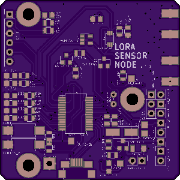
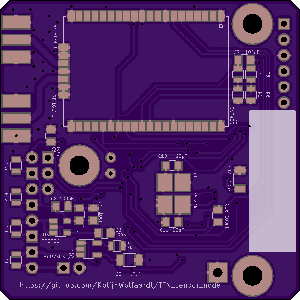

# TTN Sensor Board

This is a basic sensor board I designed to experiment with the LORAWAN protocol, and [The Things Network](https://www.thethingsnetwork.org/) infrastructure. It is by no means intended to be a good or complete example of all the capabilities of either.

The board uses a Microchip RN2483 to perform the RF communication and a PIC18F46J50 for the other work. The sensors were chosen based on what was available, for experimentation. Other sensors can easily be used.

The board is powered by a single LiPo battery, which is regulated down to 3.3v. To charge the LiPo battery, A MCP73831/2 Battery Management IC is used. The power part is not finished yet, as the batteries have not arrived, so there might be updates here.

## Datasheets
* Microcontroller [PIC18F26J50](http://ww1.microchip.com/downloads/en/DeviceDoc/39632e.pdf)
* Lora Interface module [RN2483](http://ww1.microchip.com/downloads/en/DeviceDoc/50002346A.pdf)
* Battery Management IC [MCP73831/2](http://ww1.microchip.com/downloads/en/DeviceDoc/20001984g.pdf)
* Low dropout Voltage Regulator [TPS736](http://www.ti.com/lit/ds/symlink/tps736.pdf)
* Ambient Light Sensor [BH1603FVC](http://rohmfs.rohm.com/en/products/databook/datasheet/ic/sensor/light/bh1603fvc-e.pdf)
* Thermistor [MCP9701/9701A](http://ww1.microchip.com/downloads/en/DeviceDoc/21942e.pdf)
* P-channel MOSFET [NXP BSS84](http://www.nxp.com/documents/data_sheet/BSS84.pdf)
* N-channel MOSFET [NXP 2N7002](https://www.nxp.com/documents/data_sheet/2N7002.pdf)

Thanks to [https://github.com/jpmeijers/RN2483shield](https://github.com/jpmeijers/RN2483shield) for the RN2483 component and module.

## Schematic and PCB layout
The schematic and PCB layout were created using KiCad, and can be found in the **PCB Layout** folder. The gerber files and schematic PDF can also be found there.

  

## Firmware
The firmware can be found in the Firmware folder, and is intended for the [XC8](http://www.microchip.com/mplab/compilers) compiler using the [MPLABX](http://www.microchip.com/mplab/mplab-x-ide) IDE. The board is programmed with a PicKIT 3 programmer, but the PicKIT 2 should also work. The basic flow of the program is shown in basic_control_flow.dia (Open with [http://dia-installer.de/](Dia) flowchart editor) inside the Firmware folder.

[comment]: #  (For more details on the software, see [Firmware/README.md](Firmware/README.md) )

The radio connects via ABP (Activation by personalization). The keys were programmed beforehand using a USB-serial converter, and the radio stores them internally. I will add some code later to set them in the code.

USB stack adapted from [https://github.com/signal11/m-stack.git](https://github.com/signal11/m-stack.git), for its license see the LICENSE file.

[comment]: # (Bill of Materials)

## Board Mistakes
There are two mistakes on the board:
* The ground pin on the PicKit header is not connected.
* The battery voltage measurement circuit does not work. I replaced it with a voltage divider.

These are suggestions that require more rework, but are only for ease of use.
* I cannot identify pin 1 of the optical sensor, so I left it off.
* Breaking out the TX and RX lines to the RF module would have eased debugging.
* A reset button would be nice, resetting both the MCU and the RF module.
